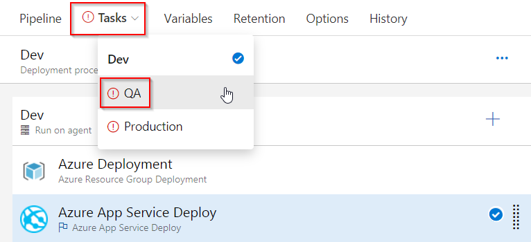
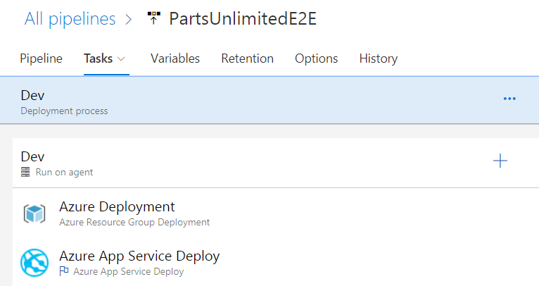
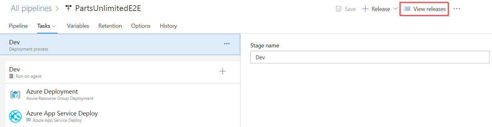
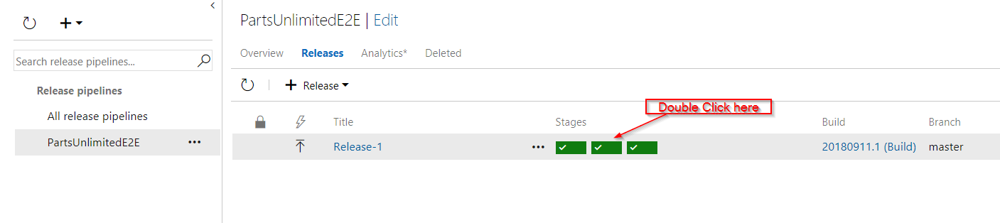

## Overview

This lab details the deployment of an [ASP.NET](https://www.asp.net/){:target="_blank"} application to the Azure App Service using **Azure DevOps  Organization**.
ASP.NET is an open source web framework for building modern web applications and services. ASP.NET creates websites based on HTML5, CSS, and JavaScript that are simple, fast, and can scale to millions of users.

### Prerequisites for the lab

1. **Microsoft Azure Account**: You will need a valid and active Azure account for the Azure labs. If you do not have one, you can sign up for a [free trial](https://azure.microsoft.com/en-us/free/){:target="_blank"}

    * If you are an active Visual Studio Subscriber, you are entitled for a $50-$150 credit per month. You can refer to this [link](https://azure.microsoft.com/en-us/pricing/member-offers/msdn-benefits-details/){:target="_blank"} to find out more information about this, including how to activate and start using your monthly Azure credit.

    * If you are not a Visual Studio Subscriber, you can sign up for the FREE [Visual Studio Dev Essentials](https://www.visualstudio.com/dev-essentials/){:target="_blank"} program to create an **Azure free account** (includes 1 year of free services, $200 for 1st month).

1. You will need an **Azure DevOps Organization**. If you do not have one, you can sign up for free [here](https://www.visualstudio.com/products/visual-studio-team-services-vs){:target="_blank"}

## Setting up the Azure DevOps Project

1. Use the [Azure DevOps Demo Generator](https://azuredevopsdemogenerator.azurewebsites.net/?TemplateId=77379&Name=PartsUnlimited){:target="_blank"} to provision team project on your Azure DevOps Organization.

   > **Azure DevOps Demo Generator** helps you create team projects on your Azure DevOps Organization with sample content that include source code, work items, iterations, service endpoints, build and release definitions based on the template you choose during the configuration.

   

1. Once team project is provisioned, click on the URL to navigate to the team project.

   

## Exercise 1: Configure Release

1. Click on **Pipelines** section and then click on **Releases**. Select the release definition **PartsUnlimitedE2E** and click on **Edit**.

   

1. Select the **Tasks** tab and click on **Dev** option.

   

1. Select the **Azure Resource Group Deployment** task, choose the **Azure subscription**. There are 2 ways of choosing the Azure subscription.
   
    * If your subscription is not listed or if you want to use an existing service principal, click the `Manage` link. 

        1. Click on the `+New Service Connection` button and select the **Azure Resource Manager** option. Provide Connection name, select the Azure Subscription from the list and the click on the Ok button. The Azure credentials will be required to authorize the connection.

        

    * If the subscription is already listed, select the Azure subscription from the list and click `Authorize`.

        

1. Select the desired **Location** for deployment.

    

1. Select **Azure App Service Deploy** task and pick **Azure subscription** from the dropdown list. In the **Slot** section, provide slot name as **Dev**.

   

1. Similarly configure **Azure subscription** for **QA** and **Production** environments. Select the **Tasks** tab and click on **QA** option.

   

1. Select **Azure App Service Deploy** task and pick the **Azure subscription** from the dropdown. Under **Slot** section enter the slot name as **Staging**.

   

1. Navigate to the **Tasks** tab and select **Production** option.

   

1. Select **Azure App Service Deploy** task, pick the **Azure subscription** from dropdown and click on **Save** to save the release definition.

   

## Exercise 3: Initiate Continuous Integration (CI) and Continuous Deployment (CD)

To automatically initiate CI-CD, the source code needs to be modified and committed to source code repository.

1. Navigate to **Repos** hub on the Azure DevOps Organization portal.

   

1. The repository contains an **ASP.NET** application source code provisioned by Azure DevOps Demo Generator. This application will be deployed to Azure App Service.

   > The team project already has a Continuous Integration (CI) build configured that gets automatically initiated when the source code modifications are committed to the repository.

1. To edit source code, open file **Index.cshtml** by navigating to below path in the master branch and click on **Edit** :

   `PartsUnlimited/PartsUnlimited-aspnet45/src/PartsUnlimitedWebsite/Views/Home/Index.cshtml`

   

1. Make some small changes to the code. For this example, change discount percentage of `50%` to `70%` on `line 28` and then click on **Commit** to save and commit the changes.

   

1. The code commit will trigger CI build. Navigate to **Pipelines** tab to view the build in progress.

   

   The following tasks are used in the build definition:

   | Tasks used in Build | Usage / Purpose |
   |-------|-------|
   | **Nuget Installer**| Nuget installer restores and updates all the package dependencies required to compile the project|
   | **Visual Studio Build**| The Visual Studio Build task is used to invoke the MS build to compile and package the output as a zip file.|
   | **Visual Studio Test**| As a part of the build process, all the unit tests included in the project will be executed using the VisualStudio Test task to ensure the code quality. This project contains 16 unit tests|
   | **Copy Files**| This task is used to copy the zipped binaries and the ARM template to a staging directory|
   | **Publish Build Artifacts**| This task is used to deploy the binaries in the staging directory that were copied in the previous step|

1. To view the live progress of build, click on ellipsis and select **View build results**.

   

   

1. Once the build is completed, build summary display **Test Results**, **Code Coverage** etc.

   

## Exercise 4: Continuous Delivery

The release pipeline is configured as **Infrastructure as a Code** to deploy application which is associated to the build and is automatically triggered when the build is successfully completed.

1. To view the release progress, click on the **Pipelines** hub and select the **Release** option. Select **PartsUnlimitedE2E** definition, to view the release in progress.

1.  Click on **Edit** to view the release pipeline. There are three configured deployment environments namely the **Dev**, **QA** and **Production**.

    

1. Select the **Dev** environment to view the tasks configured.

   

   | Tasks used in Release | Usage / Purpose |
   |-------|-------|
   | **Azure Resource Group Deployment**|The project used in this lab contains the front-end (Azure App Service) and back-end (Azure SQL DB) services. These will be provisioned as [PAAS on Azure](https://azure.microsoft.com/en-in/overview/what-is-paas/){:target="_blank"} using [ARM](https://docs.microsoft.com/en-us/azure/azure-resource-manager/resource-manager-create-first-template){:target="_blank"} templates. The task will create the above services in a resource group named **ASPDOTNET**|
   | **Azure App Service Deploy**| The task is used to deploy a Web project to the Azure App Service created in the previous step|

1. To view the outcome of release, click on **View releases** option.

   

1. To view release summary for the environment, double click on the environment blocks displayed in the report and click on **Logs** to view the detailed release summary for each environment. 

   

   

1. Login to [Azure Portal](https://portal.azure.com) and search for a **Resource Group** named **ASPDOTNET**.

   

1. Browse either the deployed Dev or Staging web application from the resource group to validate that the changes have been deployed successfully.

   

## Summary

The **VSTS** simplifies the creation of the continuous integration and continuous delivery pipelines for the application to be deployed to the Azure platform.