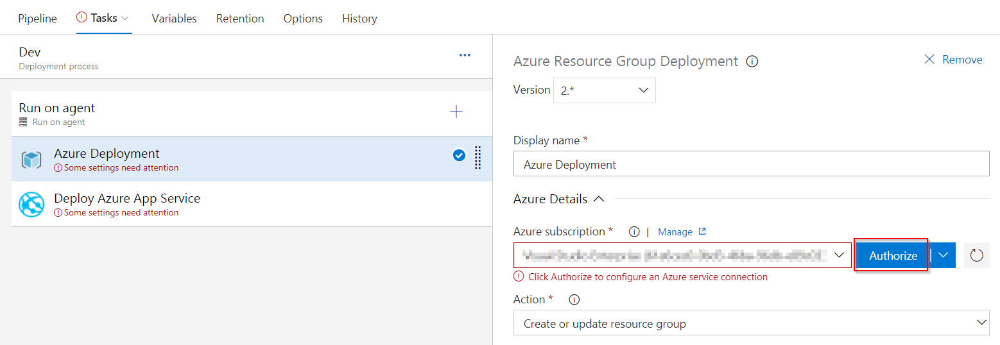

Last updated : {{ "now" | date: "%b %d, %Y" }}

## Overview

**GitHub** is a web based **Git** version control repository hosting service which offers distributed version control and source code management functionality of Git.

Visual Studio Team Services provides a first-class support for **Git** with several advantages including

* Unlimited free private repositories
* Powerful code reviews
* Advanced branch policies
* Integrated CI/CD pipeline
* Semantic code search

The primary difference between the two is that VSTS is focused on closed source projects and GitHub is focused more on open source projects. GitHub offers both private and public repositories. However, it doesn't have an integrated build server.

Teams can overcome this shortfall by using Visual Studio Team Services (VSTS) as a continuous integration platform for GitHub.

### What's covered in this lab

In this hands-on lab, we will introduce you to open source DevOps using **GitHub, Visual Studio Team Services** and **Azure**. You will learn how to deploy an **ASP.Net** application to Azure App Service using CI/CD pipeline in Visual Studio Team Services with code repository in GitHub.We will cover the following steps:

* Forking project repository to your GitHub account
* Linking GitHub account to VSTS
* Editing the existing build definition to include source code from GitHub
* Configuring build Triggers
* Executing Build

### Prerequisites for the lab

1. **Microsoft Azure Account**: You will need a valid and active Azure account for the Azure labs. If you do not have one, you can sign up for a [free trial](https://azure.microsoft.com/en-us/free/){:target="_blank"}

    * If you are an active Visual Studio Subscriber, you are entitled for a $50-$150 credit per month. You can refer to this [link](https://azure.microsoft.com/en-us/pricing/member-offers/msdn-benefits-details/){:target="_blank"} to find out more information about this including how to activate and start using your monthly Azure credit.

    * If you are not a Visual Studio Subscriber, you can sign up for the FREE [Visual Studio Dev Essentials](https://www.visualstudio.com/dev-essentials/){:target="_blank"} program to create a **Azure free account** (includes 1 year of free services, $200 for 1st month).

1. You will need a **Visual Studio Team Services Account**. If you do not have one, you can sign up for free [here](https://www.visualstudio.com/products/visual-studio-team-services-vs){:target="_blank"}

1. You will need a **Personal Access Token** to set up your project using the **VSTS Demo Generator**. Please see this [article](https://docs.microsoft.com/en-us/vsts/accounts/use-personal-access-tokens-to-authenticate){:target="_blank"} for instructions to create your token.

    

1. A **GitHub** account. Create a new account from [here](https://github.com/join?source=header-home){:target="_blank"}.

## Setting up the code repository on GitHub

There are multiple ways to add code to a GitHub repository. We can start with a new empty repository and manually add files, commit and push. But for the purpose of this lab, we will ***Fork*** an existing repository. A *Fork* is nothing but a copy of a repository.  When we *Fork*, we are creating a personal copy of the repository - any changes that we make will not affect the original code. If we want  to contribute back to the original, you can submit a *Pull Request*

1. Let us go to [**GitHub**](http://www.github.com){:target="_blank"} and make sure we are logged in with our GitHub user account.

1. Let us navigate to the [**PartsUnlimitedE2E**](https://github.com/Microsoft/PartsUnlimitedE2E){:target="_blank"} repository and select **Fork** to our GitHub account.

   

## Setting up the VSTS team project

1. Use the [VSTS Demo Generator](https://vstsdemogenerator.azurewebsites.net/?Name=GitHub&TemplateId=77366) to provision the team project on the VSTS account.

   > **VSTS Demo Generator** helps you create team projects on your VSTS account with sample content that include source code, work items,iterations, service endpoints, build and release definitions based on the template you choose during the configuration.

   

1. Once the team project is provisioned, click on the URL to navigate to the team project.

   

## Exercise 1: Connecting VSTS to GitHub repository

1. In the VSTS home page, click on the **Project settings** gear icon and then click on the **Service connections** option to navigate to the **Service connections** screen.
Click on the **+New Service Endpoint** dropdown and select the **Github** option. 

   

   {% include important.html content= "We will need to specify what authorization method you want to provide. If we choose **Grant Authorization**, the default option, as the authorization method, the dialog shows an **Authorize** button that opens the GitHub login page. If we select **Personal access token**, we must obtain a suitable token and paste it into the Token textbox. The dialog shows the recommended scopes for the token: ***repo, user, admin:repo_hook***. See [this page](https://help.github.com/articles/creating-an-access-token-for-command-line-use/){:target=\"_blank\"} on GitHub for information about obtaining an access token." %}

1. Select **Grant Authorization**. Click on the **Authorize** button which opens the **GitHub login page**.

   We will follow the steps required by GitHub to authorize access to our account.

   

   

1. When access is granted, you will see a message that confirms the connection and you can name the connection accordingly and Click OK.

   

1. You will now see the service endpoint along with GitHub icon that you created under the **Endpoints** sub-tab.

   

## Exercise 2: Configure Build

1. Go to **Builds** under **Build & Release**. Click the ellipsis next to the build definition **GitHub** and choose **Edit**.

   

1. Click on **Get Sources** under the Tasks tab. Select **GitHub** as the source, confirm that the service endpoint connection created in #2 of the previous exercise shows up as a drop down value, select it. Select the appropriate **Repository** and choose the **master Branch** from which the source will be fetched. Save the build definition.

   

## Exercise 3: Configure Release

1. Go to Releases under Build & Release tab, edit the release definition GitHub.

   

1. Select Tasks and click **Dev**.

   

1. Select the **Azure Resource Group Deployment** task, choose the **Azure subscription**. There are 2 ways of choosing the Azure subscription.
   
    * If your subscription is not listed or if you want to use an existing service principal, click the `Manage` link. 

        1. Click on the `+New Service Connection` button and select the **Azure Resource Manager** option. Provide Connection name, select the Azure Subscription from the list and the click on the Ok button. The Azure credentials will be required to be provided to authorize the connection.

        

    * If the subscription is already listed, select the Azure subscription from the list and click `Authorize`.

        

1.  Select the desired **Location** for deployment.

    
        
1. Under **Azure App Service Deploy** task, update Azure subscription from the dropdown. Save the release definition.

   

## Exercise 4: Triggering CI and CD

Navigate to your forked GitHub repository. Let's make a simple change in the code to trigger the CI build.

1. From your forked GitHub repository, open the file **Index.cshtml** under **master** branch by navigating to the below path-

   >PartsUnlimitedE2E/PartsUnlimited-aspnet45/src/PartsUnlimitedWebsite/Views/Home/Index.cshtml

   

   

1. Edit the code. For this example, let's change **line 28** to increase discount from **50%** to **70%**.

1. Navigate to **Preview changes**, enter a commit message and click on **Commit Changes**.

   

1. The code commit will trigger a CI build. Go to the **Build** tab in your VSTS project to see the CI build in progress.

1. Once the build is complete, you will see the summary which shows **Test Results** and **Code Coverage**.

   

   > The release uses **Infrastructure as a Code** to automate the provisioning of Azure App service and SQL Azure service. The release is configured to trigger upon successful completion of the CI build.

1. Go to **Releases** tab under Build and Release hub. Select the **GitHub** definition, you will see a release in-progress.

   

1. Let us explore the release definition. Click edit to see the release pipeline where the target environment is **Dev**.

   

1. Navigate to the **Dev** environment and you will see 2 tasks are used. Let us explore the tasks.

    

    * **Azure Resource Group Deployment**: The project used in this lab has the **Azure App service** as its front-end and **Azure SQL DB service** as its back-end. We will provision these services as [PAAS](https://azure.microsoft.com/en-in/overview/what-is-paas/){:target="_blank"} on Azure using [ARM templates](https://docs.microsoft.com/en-us/azure/azure-resource-manager/resource-manager-create-first-template){:target="_blank"}. This task will create the above services in a resource group.

    * **Azure App Service Deploy**: The task is used to deploy a Web project to the Azure App Service created above.

1. Once the release is complete click on **Logs**, you will see the task-wise summary.

    

    

1. Login to [Azure Portal](https://portal.azure.com/){:target="_blank"} and search for **Github** resource group. Click the web app in the resource group and you will see the application deployed successfully with the changes.

    

## Summary

Whether your code lives in **Visual Studio Team Services** or **GitHub** (or both), manage build, test, and deploy in one place. Create and manage a Continuous Integration process that connects to GitHub, gets the source files, compiles and deploys the binaries to any environment with Continuous Deployment feature.
